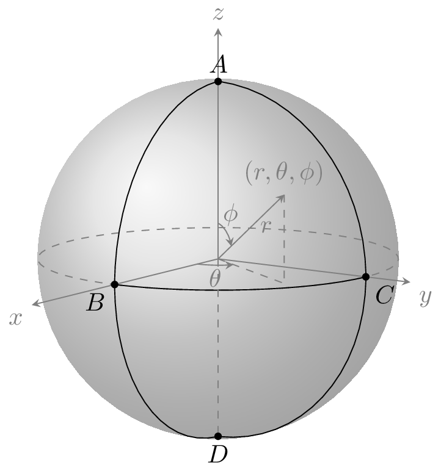
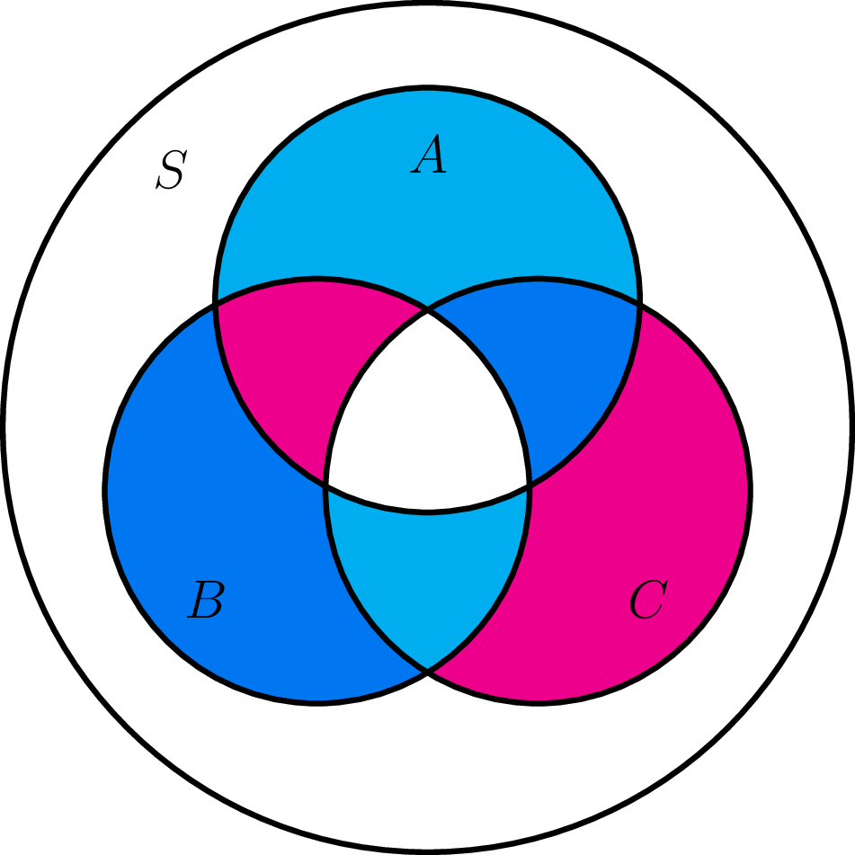
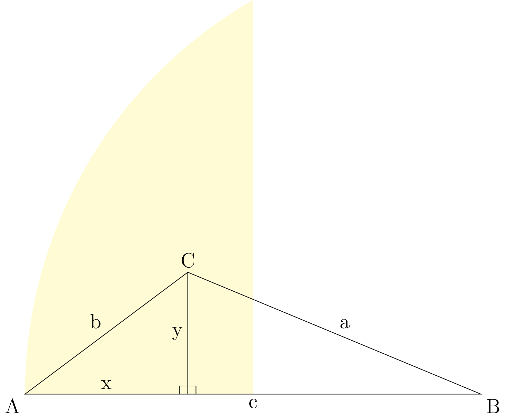
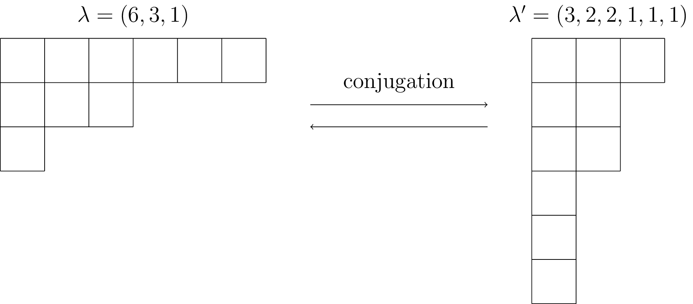
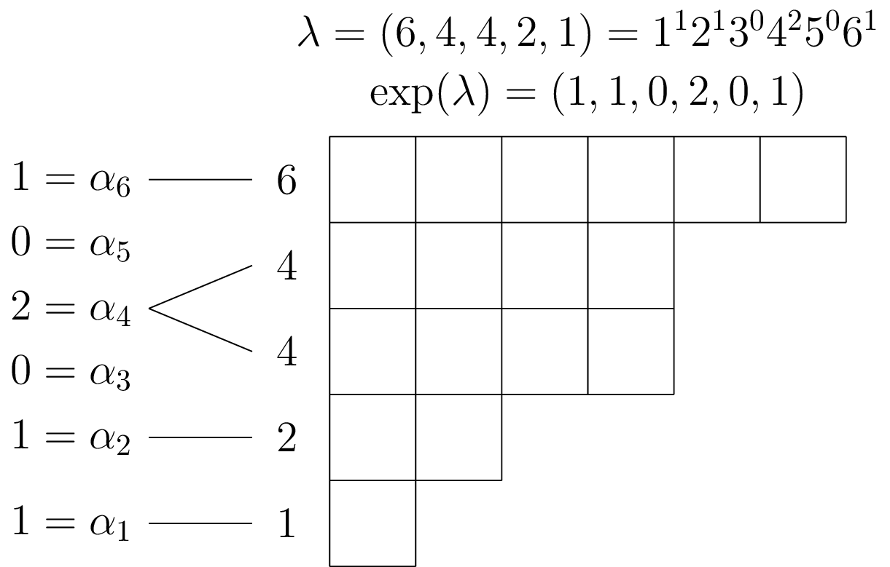
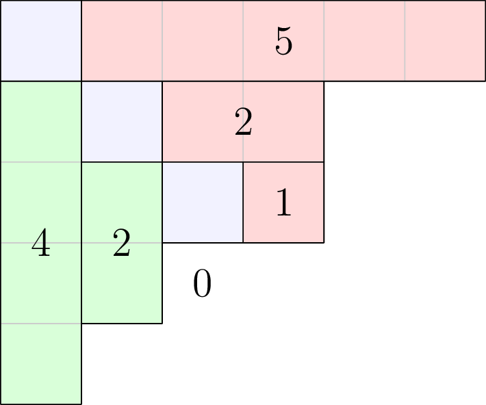

# TikZ Pictures

This repository contains examples of mathematical diagrams and the source code used to create them.

# Convert TikZ diagrams into image files
You may wish to use diagrams created using the [TikZ](https://ctan.org/pkg/pgf?lang=en) package for LaTeX in other contexts, such as in web pages, word documents, or notebooks.
For this reason, you can isolate the TikZ code into a standalone TeX file, and convert the PDF output into a portable image format for display using the following procedure.

## 1. Installation
- Install the [standalone](https://ctan.org/pkg/standalone?lang=en) document class for LaTeX
- Install [ImageMagick](https://imagemagick.org/script/download.php#windows) for image manipulation
- Install [GhostScript](https://www.ghostscript.com/download/gsdnld.html) for interpreting and rendering PDF files
- Restart your computer if you actually needed to install anything during this step (and didn't already have this software)
- We also assume you have a LaTeX distribution (with pdfLaTeX compiler) installed, since you know about TikZ pictures

## 2. Create .tex file with TikZ code 
Create a short `.tex` file using the `standalone` document class containing your TikZ picture code. The following template may be used:
``` LaTeX
\documentclass[tikz]{standalone}
% all other packages and stuff you need for the picture
\begin{document}
\begin{tikzpicture}
% your picture code
\end{tikzpicture}
\end{document}
```

## 3. Compile .tex to PDF then convert to .png
Next, run the following two commands in a terminal to compile the `.tex` file into a `.pdf`, then convert that `.pdf` file into a `.png` file.
In the example below, we have saved our TikZ code into a file named `pic.tex`. Other output file types, such as `.jpg` and `.svg` are also supported.
```
pdflatex pic.tex
magick convert -density 300 pic.pdf -quality 90 pic.png
# rm pic.aux pic.log pic.pdf
```

## 4. Automate the process for multiple .tex files using a shell script
The shell script `tikz2png.sh` provided in this repository can convert a list of standalone .tex files containing code for TikZ diagrams into .png images.
Usage is also described in the source code file. Note that the .tex files to compile to .png must be in the present working directory when executing the script.
``` bash
bash tikz2png.sh file1 file2 file3 ...
bash tikz2png.sh *.tex # compile all .tex files in the present working directory into .png files
```

## References

### PGF/TikZ graphics package for LaTeX and documentation
- https://ctan.org/pkg/pgf?lang=en

### Standalone class and package for LaTeX
- https://ctan.org/pkg/standalone?lang=en
- https://tex.stackexchange.com/questions/13349/tikz-to-non-pdf
- https://stackoverflow.com/questions/2701902/standalone-diagrams-with-tikz
- https://tex.stackexchange.com/questions/11866/compile-a-latex-document-into-a-png-image-thats-as-short-as-possible/11880#11880
- https://www.overleaf.com/learn/latex/Multi-file_LaTeX_projects
- http://lmazy.verrech.net/tag/tikz2png/
- https://github.com/reitzig/scripts/blob/master/tikz2png

### ImageMagick software for image manipulation
- https://en.wikipedia.org/wiki/ImageMagick
- https://imagemagick.org/
- https://imagemagick.org/script/convert.php

### GhostScript
- https://www.ghostscript.com/documentation.html

# Gallery of selected examples






